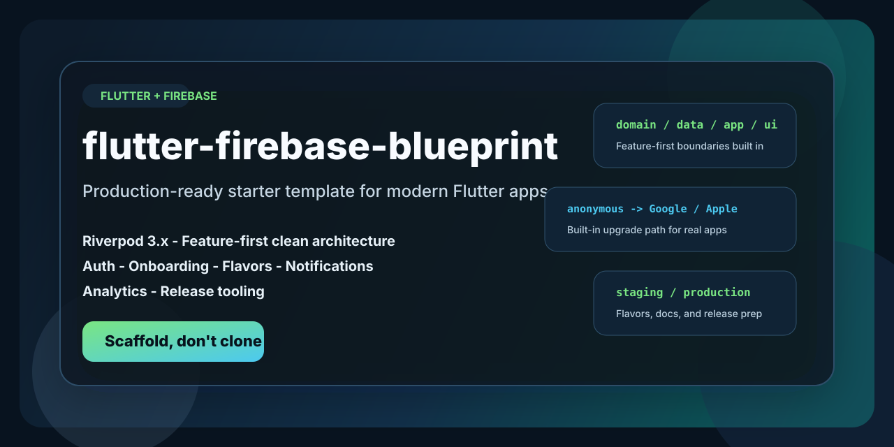
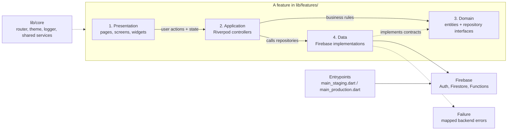

# flutter-boilerplate-blueprint

[](https://github.com/loipv/flutter-boilerplate-blueprint/tags)
[](https://github.com/loipv/flutter-boilerplate-blueprint/commits/main)
[](https://github.com/loipv/flutter-boilerplate-blueprint/blob/main/LICENSE)
[](https://github.com/loipv/flutter-boilerplate-blueprint)
[](https://github.com/loipv/flutter-boilerplate-blueprint)
[](https://github.com/loipv/flutter-boilerplate-blueprint)



Production-ready Flutter + Firebase starter template for teams that want a modern base: Riverpod 3.x, feature-first clean architecture, onboarding, anonymous-to-OAuth auth upgrades, staging/production flavors, optional notifications, analytics, and release tooling.

This repo is designed for teams who want to scaffold a real app foundation quickly, not clone a demo project and spend the next week removing outdated patterns.

## 1. Why this template is different

- Built for **Flutter + Firebase apps**, not a generic starter with Firebase added later
- Uses **feature-first clean architecture** instead of layer-first `controllers/models/views`
- Ships with **Riverpod 3.x code generation** throughout the stack
- Includes **anonymous auth to Google/Apple upgrade paths**, onboarding, and router guards
- Handles **staging/production flavors**, setup docs, release prep, and optional Functions scaffolding
- Keeps **Firebase, PostHog, and Sentry isolated** to the correct layers
- Generates a project with **AI assistant bootloader files** and project rules already in place

## 2. Who this is for

- Teams starting a new Flutter + Firebase app and wanting sensible defaults
- Solo builders who want structure without adopting an entire app framework
- Projects that need auth, onboarding, release prep, and environment separation on day one

## 3. Who this is not for

- Teams looking for a visual app kit or prebuilt product UI
- Projects that do not use Firebase
- Developers who want an unopinionated empty Flutter shell

## 4. Quick start

Latest stable blueprint version: `v0.8.1`

Review the script before running it. This scaffold requires `bash`; do not run it with `sh`. The `bash -c "$(curl ...)"` form downloads the whole script first, so nothing executes until the download finishes.

```bash
bash -c "$(curl -fsSL https://raw.githubusercontent.com/loipv/flutter-boilerplate-blueprint/main/scaffold.sh)"
```

If you need to reproduce an older blueprint version exactly, use a tag instead:

```bash
bash -c "$(curl -fsSL https://raw.githubusercontent.com/loipv/flutter-boilerplate-blueprint/v0.8.1/scaffold.sh)"
```

If you want to inspect the repo first:

```bash
git clone https://github.com/loipv/flutter-boilerplate-blueprint
cd flutter-boilerplate-blueprint
bash scaffold.sh
```

If you accidentally run it with `sh`, the script now exits immediately with a message telling you to re-run it with `bash`.

The script asks a short set of setup questions, then creates a new Flutter project with the template overlaid on top.
Generated apps also include a `BLUEPRINT_VERSION.md` file so you can see which blueprint version they were scaffolded from later.

## 5. Why this exists

Most starter projects help you get to the first screen. They do not help much with the parts that usually get messy later: auth upgrades, feature boundaries, router guards, preferences, release setup, and keeping Firebase details out of the wrong layers.

This template gives you the common plumbing without locking you into app-specific product decisions.

## 6. What you get

- Feature-first clean architecture with `domain`, `data`, `application`, and `presentation` layers per feature
- Riverpod 3.x with code generation throughout
- Anonymous sign-in on first launch, with upgrade paths to Google or Apple
- Onboarding flow with theme selection and optional account creation
- GoRouter setup with auth and onboarding guards
- Shared design system with bundled fonts, spacing tokens, and app theme
- App-level logging, haptics abstraction, and analytics abstraction
- Staging and production flavors
- Scaffolded iOS and Android flavor files for Firebase config, signing, and auth setup
- Optional local notifications with timezone re-sync and a basic reminder setting
- Optional Firebase Cloud Functions scaffold
- Makefile commands for run, build, test, codegen, and deploy workflows
- Project docs for setup, testing, release prep, and next steps
- `AGENTS.md` plus AI bootloader files for code assistants

## 7. Why teams pick this over older starters

Many Flutter + Firebase starter repos are still easy to find, but a lot of them were built around older state management, older Flutter/Firebase setup, or a "clone and manually rename everything" workflow.

This blueprint is intentionally optimized for:

- **Current architecture choices**: Riverpod 3.x, code generation, feature-first boundaries
- **Real app setup**: flavors, env files, auth setup docs, signing notes, release guidance
- **Migration-resistant structure**: Firebase stays in the data layer and entrypoints
- **Repeatable scaffolding**: `scaffold.sh` overlays the template into a fresh app instead of asking users to mutate a sample app by hand
- **Versioned blueprint releases**: `main` tracks the latest stable blueprint and tags preserve exact historical snapshots

## 8. Comparison snapshot

| Repo type                | Typical gap                                                                | This blueprint does instead                                                           |
| ------------------------ | -------------------------------------------------------------------------- | ------------------------------------------------------------------------------------- |
| Old Firebase starter     | Older packages, stale docs, manual rename flow                             | Versioned scaffold flow with current architecture rules                               |
| Generic Flutter template | Good app shell, weak Firebase/auth/release setup                           | Firebase-first setup, auth upgrades, docs, env split, flavor-aware structure          |
| Demo/reference app       | Useful patterns, but harder to repurpose as a clean starting point         | Generates a fresh project designed to be customized immediately                       |
| Low-opinion boilerplate  | Fast to clone, but leaves key architectural and setup decisions unresolved | Bakes in boundaries, docs, tooling, and feature defaults that most teams actually use |

## 9. What the scaffold asks

| Question                      | Default                   |
| ----------------------------- | ------------------------- |
| App display name              | `My App`                  |
| Package name (snake_case)     | derived from title        |
| Organization (reverse domain) | `com.example`             |
| Short description             | blank                     |
| Output directory              | `<current-dir>/<package>` |
| Anonymous sign-in             | yes                       |
| Apple Sign-In                 | yes                       |
| Google Sign-In                | yes                       |
| Push notifications            | yes                       |
| PostHog analytics             | yes                       |
| Sentry error monitoring       | yes                       |
| Cloud Functions (TypeScript)  | yes                       |
| Use FVM                       | yes, if installed         |
| FVM Flutter SDK               | blueprint-tested `3.41.4` |
| AI coding assistant           | Claude Code               |
| Bottom nav tabs               | 3 tabs                    |
| Color preset                  | Sage Green, or custom hex |

If you enable FVM, the scaffold defaults to a blueprint-tested Flutter SDK (`3.41.4`) so generated apps are reproducible against the version this template was validated on. You can opt into the latest stable channel during scaffolding if you prefer newer SDK bits over strict reproducibility.

## 10. Architecture at a glance

The template uses a feature-first clean architecture. Each feature owns four layers, and each layer has a narrow job.

Shared concerns such as routing, theming, logging, and error types live in `lib/core`. Firebase stays in entrypoints and data implementations.



Read it left to right: UI in `presentation` talks to controllers in `application`, business rules live in `domain`, and Firebase work happens in `data`. `lib/core` supports all features, and backend errors are mapped to `Failure` before they reach higher layers.

## 11. Generated project shape

```text
<your-app>/
├── lib/
│   ├── app.dart
│   ├── main_staging.dart
│   ├── main_production.dart
│   ├── core/
│   │   ├── constants/
│   │   ├── data/
│   │   ├── domain/
│   │   ├── errors/
│   │   ├── presentation/
│   │   ├── providers/
│   │   ├── router/
│   │   ├── services/
│   │   ├── theme/
│   │   └── utils/
│   └── features/
│       ├── auth/
│       ├── onboarding/
│       ├── home/
│       ├── settings/
│       └── user_profile/
├── docs/
│   ├── next_steps.md
│   ├── setup.md
│   ├── auth_setup.md
│   ├── tech.md
│   ├── ui_ux.md
│   ├── testing_guide.md
│   ├── release_guide.md
│   └── android_signing.md
├── ios/
│   ├── config/
│   │   ├── Staging/
│   │   └── Production/
│   └── Runner/...
├── android/
│   └── app/src/{staging,production}/
├── functions/                  # optional, only if selected
├── .env.staging
├── .env.production
├── Makefile
├── firestore.rules
├── AGENTS.md
└── CLAUDE.md / CODEX.md / GEMINI.md
```

## 12. Included out of the box

- Auth flow: anonymous session on first launch, plus Google and Apple upgrade paths
- Router guards: splash during cold start, onboarding redirect, stable bottom navigation
- Preferences: theme and haptics support with local persistence and user-profile sync points
- Error handling: data layer maps backend failures to a shared `Failure` type
- Analytics and monitoring: abstracted analytics repository, with optional PostHog and Sentry integrations
- Environment split: separate staging and production entrypoints and env files
- Platform setup: flavor-aware iOS and Android config files, release signing hooks, privacy manifest, and auth-related plist handling
- Notifications: optional local reminder scaffold with permission requests, scheduling, and timezone-aware resync
- Cloud Functions: optional TypeScript scaffold when selected
- Analytics config: supports custom `POSTHOG_HOST` for region-specific or self-hosted setups

## 13. Evaluation checklist

If you are comparing starters, this repo is easiest to evaluate by checking four things:

1. Can it scaffold a new app quickly without manual repo surgery?
2. Does it keep Firebase concerns out of the wrong layers?
3. Does it already handle auth, onboarding, environments, and release prep?
4. Is there a clear blueprint version and changelog story?

## 14. After scaffolding

Start with `docs/next_steps.md` in the generated project. For most teams, the first pass looks like this:

1. Create Firebase staging and production projects.
2. Run `flutterfire configure` for each environment.
3. Fill in `.env.staging` and `.env.production`.
4. Run `make run-staging`.
5. Replace the app icon and onboarding copy.

For deeper setup details, use:

- `docs/setup.md` for Firebase, signing, and first-run setup
- `docs/auth_setup.md` for Google Sign-In, Apple Sign-In, and App Check
- `docs/testing_guide.md` for test patterns and mock usage
- `docs/release_guide.md` for iOS and Android release prep
- `docs/tech.md` for architecture and package conventions

## 15. Project rules

The full contract lives in `AGENTS.md`. The short version:

| Area         | Rule                                                                              |
| ------------ | --------------------------------------------------------------------------------- |
| Architecture | Feature-first only: `lib/features/<name>/{domain,data,application,presentation}/` |
| State        | Riverpod `@riverpod` code-gen only                                                |
| Widgets      | `ConsumerWidget` or `ConsumerStatefulWidget`, not plain `StatefulWidget`          |
| Imports      | Absolute `package:` imports only                                                  |
| Spacing      | `Gap(AppSpacing.pX)`, not `SizedBox` for layout spacing                           |
| Icons        | `lucide_icons_flutter` only                                                       |
| Fonts        | Bundled Inter and JetBrains Mono only                                             |
| Logging      | `AppLogger`, not `print()` or `debugPrint()`                                      |
| Colors       | `Color.withValues(alpha:)`, not `Color.withOpacity()`                             |
| Firebase SDK | Confined to data layers and entrypoints                                           |
| Errors       | Map backend exceptions to the `Failure` union at the data boundary                |

## 16. Contributing

PRs are welcome. Keep the template focused on patterns that most apps actually need. If a feature is too specific to a single product, it probably does not belong in the base template.

## 17. Releasing blueprint updates

The generated app has its own app version in `pubspec.yaml`. The blueprint itself has a separate version, defined in [`scaffold.sh`](./scaffold.sh) as `BLUEPRINT_VERSION`.

When you cut a new blueprint version:

1. Update `BLUEPRINT_VERSION` in [`scaffold.sh`](./scaffold.sh).
2. Update the "Latest stable blueprint version" line in [`README.md`](./README.md).
3. Update the older-version tagged example in [`README.md`](./README.md) to use the latest released tag.
4. Add a new entry to [`CHANGELOG.md`](./CHANGELOG.md) describing what changed in that blueprint release.
5. Review the generated metadata file [`template/BLUEPRINT_VERSION.md`](./template/BLUEPRINT_VERSION.md) and the note in [`template/docs/next_steps.md`](./template/docs/next_steps.md). They are tokenized from `BLUEPRINT_VERSION`, so no manual version edit should be needed there.
6. Commit the blueprint changes.
7. Create an annotated tag for the new version.
8. Push the branch and the tag.

Example for `v0.2.0`:

```bash
git add CHANGELOG.md README.md scaffold.sh template/BLUEPRINT_VERSION.md template/docs/next_steps.md
git commit -m "Release blueprint v0.2.0"
git tag -a v0.2.0 -m "Blueprint 0.2.0"
git push origin main
git push origin v0.2.0
```

The default quick-start command should point at `main`, which stays aligned with the latest stable blueprint. Tags are for reproducible snapshots when someone needs an older exact version. Users can check [`CHANGELOG.md`](./CHANGELOG.md) to see what changed between blueprint versions.

## 18. License

MIT
